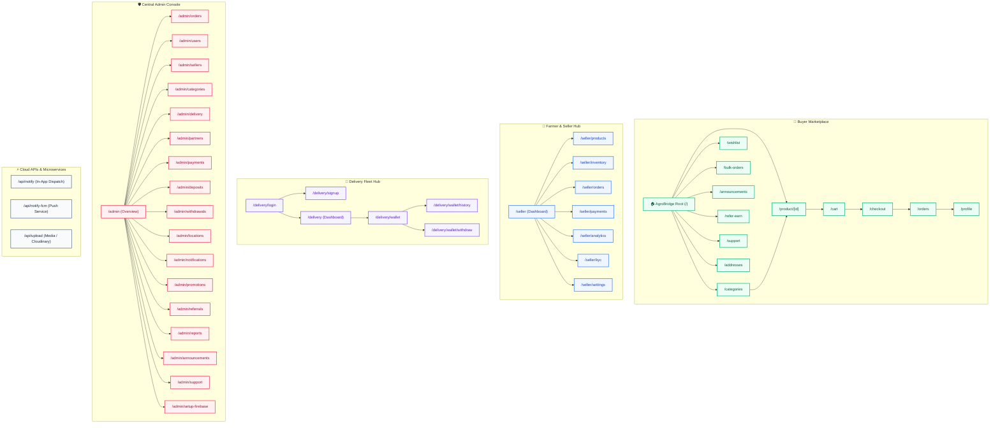
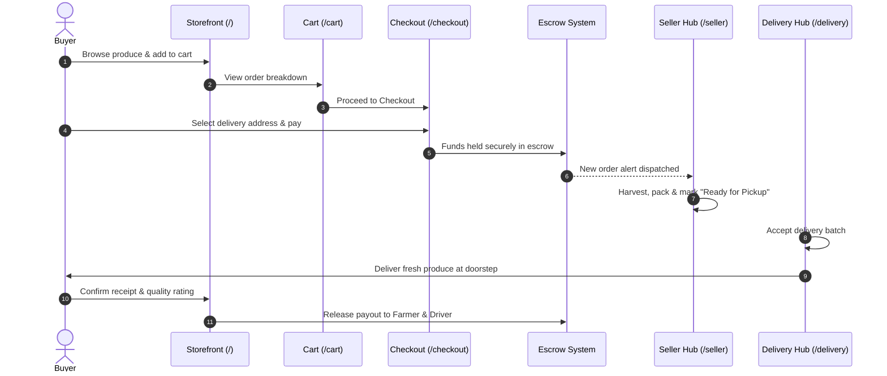
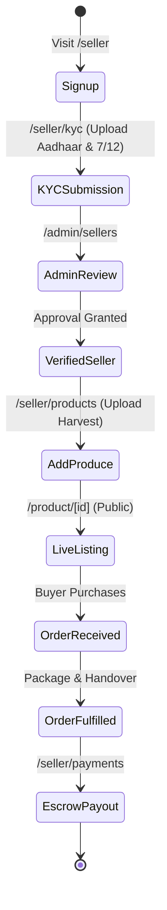

# 🗺️ AgroBridge / KisanMart — Complete Route Directory

> Comprehensive guide to all **50 routes** across the **Next.js App Router** architecture, categorized by user roles, rendering modes, and operational workflows.

---

## 📊 Route Summary Matrix

| Portal / Module | Route Count | Access Level | Primary Layout |
| :--- | :---: | :--- | :--- |
| **Buyer Storefront** | 13 | Public / Authenticated Buyer | `app/(buyer)/layout.jsx` |
| **Admin Operations** | 20 | Admin & Operational Staff | `app/admin/layout.jsx` |
| **Seller / Farmer Portal** | 8 | Verified Farmers & Merchants | `app/seller/layout.jsx` |
| **Delivery Fleet** | 6 | Delivery Agents & Couriers | `app/delivery/` |
| **Platform APIs & Utilities** | 4 | Server / Public Endpoints | `app/api/` & Root |
| **Total Active Routes** | **51** | — | — |

---

## 🏛️ Application Architecture & Navigation Flow

---

## 1. 🛒 Buyer & Marketplace Storefront (13 Routes)

| Route Path | Source File | Mode | Role / Auth | Description |
| :--- | :--- | :---: | :--- | :--- |
| `/` | [`app/(buyer)/page.jsx`](file:///d:/KisanMart-main/app/(buyer)/page.jsx) | `Static` | Public | Homepage featuring hero banners, categories, flash deals, and testimonials |
| `/categories` | [`app/(buyer)/categories/page.jsx`](file:///d:/KisanMart-main/app/(buyer)/categories/page.jsx) | `Static` | Public | Produce taxonomy filter (vegetables, fruits, grains, pulses, dairy) |
| `/product/[id]` | [`app/(buyer)/product/[id]/page.jsx`](file:///d:/KisanMart-main/app/(buyer)/product/[id]/page.jsx) | `Dynamic` | Public | Product page with price-per-kg, tier pricing, reviews, and farm origin details |
| `/cart` | [`app/(buyer)/cart/page.jsx`](file:///d:/KisanMart-main/app/(buyer)/cart/page.jsx) | `Static` | Public | Buyer cart summary, quantity toggles, delivery calculations, and checkout triggers |
| `/checkout` | [`app/(buyer)/checkout/page.jsx`](file:///d:/KisanMart-main/app/(buyer)/checkout/page.jsx) | `Static` | Buyer | Address picker, escrow payment gateway selection (UPI, Card, NetBanking) |
| `/orders` | [`app/(buyer)/orders/page.jsx`](file:///d:/KisanMart-main/app/(buyer)/orders/page.jsx) | `Static` | Buyer | Real-time order timeline tracking, invoice downloads, and status badges |
| `/wishlist` | [`app/(buyer)/wishlist/page.jsx`](file:///d:/KisanMart-main/app/(buyer)/wishlist/page.jsx) | `Static` | Buyer | Saved produce list with one-tap transfer to cart |
| `/addresses` | [`app/addresses/page.jsx`](file:///d:/KisanMart-main/app/addresses/page.jsx) | `Static` | Buyer | Delivery address management with GPS geolocation detection |
| `/profile` | [`app/profile/page.jsx`](file:///d:/KisanMart-main/app/profile/page.jsx) | `Static` | Buyer | Personal info, account security, linked bank accounts, and order history |
| `/bulk-orders` | [`app/(buyer)/bulk-orders/page.jsx`](file:///d:/KisanMart-main/app/(buyer)/bulk-orders/page.jsx) | `Static` | B2B Buyer | B2B wholesale quotation requests, ton-scale procurement for institutions |
| `/refer-earn` | [`app/refer-earn/page.jsx`](file:///d:/KisanMart-main/app/refer-earn/page.jsx) | `Static` | Buyer | Invite-a-farmer referral program, unique links, and cash rewards tracking |
| `/announcements` | [`app/(buyer)/announcements/page.jsx`](file:///d:/KisanMart-main/app/(buyer)/announcements/page.jsx) | `Static` | Public | Public notifications, seasonal harvest announcements, and platform notices |
| `/support` | [`app/support/page.jsx`](file:///d:/KisanMart-main/app/support/page.jsx) | `Static` | Public / Buyer | Support ticket creator, live chat gateway, and FAQ articles |

---

## 2. 🛡️ Admin Portal (19 Routes)

| Route Path | Source File | Mode | Description |
| :--- | :--- | :---: | :--- |
| `/admin` | [`app/admin/page.jsx`](file:///d:/KisanMart-main/app/admin/page.jsx) | `Static` | Central admin cockpit: GMV metrics, active users, orders, revenue charts |
| `/admin/orders` | [`app/admin/orders/page.jsx`](file:///d:/KisanMart-main/app/admin/orders/page.jsx) | `Static` | Global order stream: state transitions, delivery tracking, manual interventions |
| `/admin/users` | [`app/admin/users/page.jsx`](file:///d:/KisanMart-main/app/admin/users/page.jsx) | `Static` | User directory: permissions, phone verifications, block/unblock controls |
| `/admin/sellers` | [`app/admin/sellers/page.jsx`](file:///d:/KisanMart-main/app/admin/sellers/page.jsx) | `Static` | Seller KYC inspection, document validation, verified farmer status toggles |
| `/admin/categories` | [`app/admin/categories/page.jsx`](file:///d:/KisanMart-main/app/admin/categories/page.jsx) | `Static` | Produce taxonomy editor: add categories, subcategories, unit standards (kg/ton) |
| `/admin/delivery` | [`app/admin/delivery/page.jsx`](file:///d:/KisanMart-main/app/admin/delivery/page.jsx) | `Static` | Delivery driver management: fleet allocation, zone mapping, vehicle checks |
| `/admin/partners` | [`app/admin/partners/page.jsx`](file:///d:/KisanMart-main/app/admin/partners/page.jsx) | `Static` | Corporate & logistics partners: cold chain storage facilities & transporters |
| `/admin/payments` | [`app/admin/payments/page.jsx`](file:///d:/KisanMart-main/app/admin/payments/page.jsx) | `Static` | Escrow settlement console: transaction logs, refund overrides, fee margins |
| `/admin/deposits` | [`app/admin/deposits/page.jsx`](file:///d:/KisanMart-main/app/admin/deposits/page.jsx) | `Static` | Escrow security deposits, wallet balance verification |
| `/admin/withdrawals` | [`app/admin/withdrawals/page.jsx`](file:///d:/KisanMart-main/app/admin/withdrawals/page.jsx) | `Static` | Payout approvals for farmers and drivers, bank account NEFT/IMPS dispatches |
| `/admin/locations` | [`app/admin/locations/page.jsx`](file:///d:/KisanMart-main/app/admin/locations/page.jsx) | `Static` | Geofencing, serviceable pincodes, delivery hubs, and city activations |
| `/admin/notifications` | [`app/admin/notifications/page.jsx`](file:///d:/KisanMart-main/app/admin/notifications/page.jsx) | `Static` | Targeted push notification composer, segment broadcasting (buyers/farmers) |
| `/admin/promotions` | [`app/admin/promotions/page.jsx`](file:///d:/KisanMart-main/app/admin/promotions/page.jsx) | `Static` | Promo code generator, discount rules, seasonal campaign banners |
| `/admin/referrals` | [`app/admin/referrals/page.jsx`](file:///d:/KisanMart-main/app/admin/referrals/page.jsx) | `Static` | Referral program analytics, fraud detection, bonus disbursements |
| `/admin/reports` | [`app/admin/reports/page.jsx`](file:///d:/KisanMart-main/app/admin/reports/page.jsx) | `Static` | Financial audits, sales volume exports, CSV data reports |
| `/admin/announcements` | [`app/admin/announcements/page.jsx`](file:///d:/KisanMart-main/app/admin/announcements/page.jsx) | `Static` | Announcement manager for homepage banners and alerts |
| `/admin/support` | [`app/admin/support/page.jsx`](file:///d:/KisanMart-main/app/admin/support/page.jsx) | `Static` | Support desk: resolve dispute tickets between buyers and sellers |
| `/admin/setup-firebase` | [`app/admin/setup-firebase/page.jsx`](file:///d:/KisanMart-main/app/admin/setup-firebase/page.jsx) | `Static` | Initial database seeder & Firestore collection configuration utility |
| `/admin/settings` | [`app/admin/settings/page.jsx`](file:///d:/KisanMart-main/app/admin/settings/page.jsx) | `Static` | Global platform settings: escrow inspection windows, tax rates, fleet parameters |

---

## 3. 🌾 Seller / Farmer Portal (8 Routes)

| Route Path | Source File | Mode | Description |
| :--- | :--- | :---: | :--- |
| `/seller` | [`app/seller/page.jsx`](file:///d:/KisanMart-main/app/seller/page.jsx) | `Static` | Farmer hub: current revenue, active batches, low-stock warnings, order alerts |
| `/seller/products` | [`app/seller/products/page.jsx`](file:///d:/KisanMart-main/app/seller/products/page.jsx) | `Static` | Harvest catalogue management: add crops, upload images, set base price |
| `/seller/inventory` | [`app/seller/inventory/page.jsx`](file:///d:/KisanMart-main/app/seller/inventory/page.jsx) | `Static` | Stock control: update available kilograms, harvest dates, and expiry windows |
| `/seller/orders` | [`app/seller/orders/page.jsx`](file:///d:/KisanMart-main/app/seller/orders/page.jsx) | `Static` | Order intake: confirm packing, schedule driver pickup, inspect addresses |
| `/seller/payments` | [`app/seller/payments/page.jsx`](file:///d:/KisanMart-main/app/seller/payments/page.jsx) | `Static` | Financial ledger: escrow balance, pending releases, request payout |
| `/seller/analytics` | [`app/seller/analytics/page.jsx`](file:///d:/KisanMart-main/app/seller/analytics/page.jsx) | `Static` | Crop demand insights, price comparisons across regional mandis |
| `/seller/kyc` | [`app/seller/kyc/page.jsx`](file:///d:/KisanMart-main/app/seller/kyc/page.jsx) | `Static` | Identity verification: Aadhaar, Land Record (7/12 extract), Bank verification |
| `/seller/settings` | [`app/seller/settings/page.jsx`](file:///d:/KisanMart-main/app/seller/settings/page.jsx) | `Static` | Farm location coordinates, operating hours, notification preferences |

---

## 4. 🚚 Delivery Fleet Portal (6 Routes)

| Route Path | Source File | Mode | Description |
| :--- | :--- | :---: | :--- |
| `/delivery` | [`app/delivery/page.jsx`](file:///d:/KisanMart-main/app/delivery/page.jsx) | `Static` | Driver dashboard: available pickup batches, navigation, delivery status updates |
| `/delivery/login` | [`app/delivery/login/page.jsx`](file:///d:/KisanMart-main/app/delivery/login/page.jsx) | `Static` | Fleet agent mobile authentication with phone OTP |
| `/delivery/signup` | [`app/delivery/signup/page.jsx`](file:///d:/KisanMart-main/app/delivery/signup/page.jsx) | `Static` | Driver onboarding: driving license upload, vehicle details registration |
| `/delivery/wallet` | [`app/delivery/wallet/page.jsx`](file:///d:/KisanMart-main/app/delivery/wallet/page.jsx) | `Static` | Driver wallet: earned tips, per-delivery payouts, current balance |
| `/delivery/wallet/history`| [`app/delivery/wallet/history/page.jsx`](file:///d:/KisanMart-main/app/delivery/wallet/history/page.jsx) | `Static` | Trip-by-trip earnings log and payout status |
| `/delivery/wallet/withdraw`| [`app/delivery/wallet/withdraw/page.jsx`](file:///d:/KisanMart-main/app/delivery/wallet/withdraw/page.jsx) | `Static` | Instant withdrawal request to linked UPI ID or bank account |

---

## 5. ⚡ APIs & Utility Routes (4 Routes)

| Route Path | Source File | Method | Purpose |
| :--- | :--- | :---: | :--- |
| `/api/notify` | [`app/api/notify/route.js`](file:///d:/KisanMart-main/app/api/notify/route.js) | `POST` | Dispatches notifications to Firestore and updates in-app notification center |
| `/api/notify-fcm` | [`app/api/notify-fcm/route.js`](file:///d:/KisanMart-main/app/api/notify-fcm/route.js) | `POST` | Dispatches mobile / PWA push notifications via Firebase Cloud Messaging |
| `/api/upload` | [`app/api/upload/route.js`](file:///d:/KisanMart-main/app/api/upload/route.js) | `POST` | Uploads product photos, KYC documents, and delivery proofs |
| `/coming-soon` | [`app/coming-soon/page.jsx`](file:///d:/KisanMart-main/app/coming-soon/page.jsx) | `Static` | Dynamic placeholder for features currently in pilot rollout |

---

## 🔄 Core User Flow Transitions

### 1. Buyer Purchasing & Escrow Journey

### 2. Farmer Onboarding & Sales Cycle

